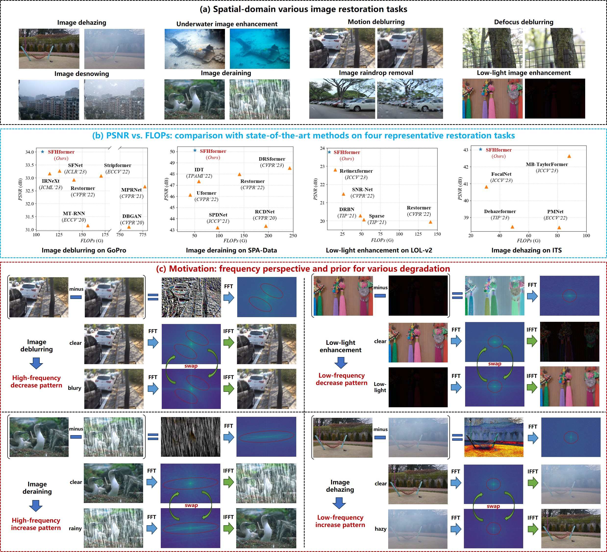

## [When Fast Fourier Transform Meets Transformer for Image Restoration] (ECCV 2024)
 Official implementation.
 
## Authors
Xingyu Jiang, Xiuhui Zhang, Ning Gao, Yue Deng *

School of Astronautics, Beihang University, Beijing, China
 
#### News
Thanks for your interest in our work, we will continue to optimize our code. If you have any other questions, please feel free to raise them in the issues, and I will try my best to address them!
- **May 20, 2025:** Our extension work SWFormer:**"Image Restoration via Multi-domain Learning"** of SFHformer is available at [https://arxiv.org/pdf/2505.05504](https://arxiv.org/pdf/2505.05504). Github Code: [https://github.com/deng-ai-lab/SWFormer](https://github.com/deng-ai-lab/SWFormer).
- **Apr 11, 2025:** We release some visualizations of the dataset in the Visual result section. 
- **Mar 27, 2025:** We release the pre-training weights of ITS and OTS with the test code in the dehazing folder.
- **Oct 17, 2024:** The train code is now open and our paper is available [here](https://www.ecva.net/papers/eccv_2024/papers_ECCV/papers/06190.pdf)! 
- **Jul 25, 2024:** Paper accepted at ECCV 2024.

> **Abstract:** *Natural images can suffer from various degradation phenomena caused by adverse atmospheric conditions or unique degradation mechanism. Such diversity makes it challenging to design a universal framework for kinds of restoration tasks. Instead of exploring the commonality across different degradation phenomena, existing image restoration methods focus on the modification of network architecture under limited restoration priors. In this work, we first review various degradation phenomena from a frequency perspective as prior. Based on this, we propose an efficient image restoration framework, dubbed SFHformer, which incorporates the Fast Fourier Transform mechanism into Transformer architecture. Specifically,  we design a dual domain hybrid structure for multi-scale receptive fields modeling, in which the spatial domain and the frequency domain focuses on local modeling and global modeling, respectively. Moreover, we design unique positional coding and frequency dynamic convolution for each frequency component to extract rich frequency-domain features. Extensive experiments on thirty-one restoration datasets for a range of ten restoration tasks such as deraining, dehazing, deblurring, desnowing, denoising, super-resolution and underwater/low-light enhancement, demonstrate that our SFHformer surpasses the state-of-the-art approaches and achieves a favorable trade-off between performance, parameter size and computational cost.* 

## Introduction

 

## Network Architecture

 

## Results
Experiments are performed for different image restoration tasks including, image dehazing, image deraining, image desnowing, image denoising, image super-resolution, single-image motion deblurring, defocus deblurring, image raindrop removal, low-light image enhancement and underwater image enhancement. 

<strong>Image Dehazing</strong> (click to expand) 

 

<strong>Image Deraining</strong> (click to expand) 

 

<strong>Image Desnowing</strong> (click to expand) 

 

<strong>Image Super-resolution</strong> (click to expand) 

 

<strong>Image Raindrop Removal</strong> (click to expand) 

 

<strong>Single-Image Motion Deblurring</strong> (click to expand) 

<strong>Defocus Deblurring</strong> (click to expand) 

 

<strong>Image Denoising</strong> (click to expand) 

 

<strong>Underwater Image Enhancement</strong> (click to expand) 

 

<strong>Low-light Image Enhancement</strong> (click to expand) 

 

## Prepare Datasets

**Deraining Datasets:** <a href="https://pan.baidu.com/s/1OCaSuwQRgkpm3kU55Hef0Q?pwd=sakm">Rain200L/Rain200H</a> <a href="https://pan.baidu.com/s/1zknuXnv5MR6yhS0I8u2uZg?pwd=h8vv">DDN-Data</a> <a href="https://pan.baidu.com/s/1RsDzu_lS-l2_FxdUnBarOQ?pwd=vxgq">DID-Data Train</a> <a href="https://pan.baidu.com/s/1sJUb6iwxAWOcoBBLn0iuUA?pwd=6bpj">DID-Data Test</a> <a href="https://pan.baidu.com/s/1ESuLn9a9G0QRD22MLxDPxw?pwd=bnqh">SPA-Data</a> <a href="https://pan.baidu.com/s/1zztcAht2aQje4hHcDnGynQ?pwd=2y7d">Raindrop</a>

**Dehazing Datasets:** <a href="https://pan.baidu.com/s/11Pfl227viFijuw8jmAGcJw?pwd=m82m">ITS</a> <a href="https://pan.baidu.com/s/10N63st8dlzkGB5v-JjUULg?pwd=16ag">OTS</a> <a href="https://pan.baidu.com/s/1e8OG6aNgFSm9SHYQ2pvyuA?pwd=7xwn">O-HAZE</a> <a href="https://pan.baidu.com/s/1seuSmqRUAgC5zGXS9xtxPw?pwd=nyyt">NH-HAZE</a> <a href="https://pan.baidu.com/s/1hjysGvoVatWaY_FrmWeLmQ?pwd=xfu4">DENSE-HAZE</a> <a href="https://pan.baidu.com/s/1mcULooUYzGBRgqaEGFLQ0Q?pwd=779y">SOTS</a> 

**Low-light Enhancement Datasets:** <a href="https://pan.baidu.com/s/1ZF4zAN7TVrj2wXLH9SdbNA?pwd=9cph">LOLv1</a> <a href="https://pan.baidu.com/s/1qmwGK2MT1rRZqsiChQi7AA?pwd=ujep">LOLv2</a> <a href="https://pan.baidu.com/s/1ALZjmzbcyt1gF5ZS-49B5A?pwd=zhcq">FiveK</a>

**Motion Deblur Datasets:** <a href="https://pan.baidu.com/s/1ANXeNVc-sySlqgpOSaq9vQ?pwd=c5jc">Motion Blur(GoPro/HIDE/RealBlur-R/RealBlur-J)</a>

**Defocus Deblur Datasets:** <a href="https://pan.baidu.com/s/1x1PPGvtmPpsxLBZtsT0cMA?pwd=ttj8">DPDD</a> 

**Desnowing Datasets:** <a href="https://pan.baidu.com/s/1iUC3Y5Wn_rpy4P48x5hpVQ?pwd=352s">CSD</a> <a href="https://pan.baidu.com/s/14bGq_pvpUXv1k1wWJqZs4g?pwd=vcda">SRRS</a> <a href="https://pan.baidu.com/s/1TjR1VIn6MIqAD7UjguAmqg?pwd=4wi3">Snow100K</a> 

**Underwater Enhancement Datasets:** <a href="https://pan.baidu.com/s/1V2tSOFkUmPIVPCAgxu5dBA?pwd=r6tf">UIEB</a> <a href="https://pan.baidu.com/s/1R_vzgn927IEu0vUAubWI-w?pwd=w3u7">LSUI</a>

**Denoise Datasets:** <a href="https://pan.baidu.com/s/1DXDmcpFbEkYP-fpR7Vd8Bw?pwd=v1mj">SIDD</a>

**Super-resolution Datasets:** <a href="https://pan.baidu.com/s/10OaDk8DttGzHO6Bh9nnPFw?pwd=68gw">DIV2K Set5 Set14 B100 Urban100 Manga109</a>

## Pretrained model
**Dehazing Datasets:** <a href="https://pan.baidu.com/s/1lfoOJLyCREXFkLHPJZJ9kQ?pwd=1v1a">ITS</a> <a href="https://pan.baidu.com/s/1BCFiHWsdkxGKpFbk68IHIQ?pwd=iz2n">OTS</a>

**Low-light Enhancement Datasets:** <a href="https://pan.baidu.com/s/1_KU_VCdCBfnyG3_CsUSuBg?pwd=7w7a">LOLv2-r</a> <a href="https://pan.baidu.com/s/1685LqNiu_c09-b8p3g4BYg?pwd=mr89">LOLv2-s</a> 

**Motion Deblur Datasets:** <a href="https://pan.baidu.com/s/1iyefA_-GZwCy1xJnNtENBw?pwd=w3gj">GoPro</a>

## Visual Results
<table>
<thead>
  <tr>
    <th>Dehazing Dataset</th>
    <th>SOTS-indoor</th>
    <th>SOTS-outdoor</th>
    <th>O-HAZE</th>
    <th>NH-HAZE</th>
    <th>DENSE-HAZE</th>
  </tr>
</thead>
<tbody>
  <tr>
    <td>Baidu NetDisk</td>
    <td> <a href="https://pan.baidu.com/s/1w3GhWD5yAd8N_JsJoXBtXA?pwd=8sj6">Download (8sj6)</a>  </td>
    <td> <a href="https://pan.baidu.com/s/1A5B3hm39YrB51rvX3RWtVw?pwd=awnk">Download (awnk)</a>  </td>
    <td> <a href="https://pan.baidu.com/s/1OMJDVsJoh4zrlvDWlZ2FNA?pwd=pfem">Download (pfem)</a>  </td>
    <td> <a href="https://pan.baidu.com/s/1N75cBd3GIinW6NA_WxiRSg?pwd=e72s">Download (e72s)</a>  </td>
    <td> <a href="https://pan.baidu.com/s/1rYXZn0dytP_On0NIRUwbPQ?pwd=r7p4">Download (r7p4)</a>  </td>
  </tr>
</tbody>
</table>

<table>
<thead>
  <tr>
    <th>Low-light Dataset</th>
    <th>LOLv2-real</th>
    <th>LOLV2-syn</th>
  </tr>
</thead>
<tbody>
  <tr>
    <td>Baidu NetDisk</td>
    <td> <a href="https://pan.baidu.com/s/1PvmOpyZEfvZ3BFvJYqaMfw?pwd=jqgh">Download (jqgh)</a>  </td>
    <td> <a href="https://pan.baidu.com/s/1Ub4xxkVXft9cKw2dkR1Rgg?pwd=wy8i">Download (wy8i)</a>  </td>
  </tr>
</tbody>
</table>

<table>
<thead>
  <tr>
    <th>Underwater Dataset</th>
    <th>UIEB</th>
    <th>LSUI</th>
  </tr>
</thead>
<tbody>
  <tr>
    <td>Baidu NetDisk</td>
    <td> <a href="https://pan.baidu.com/s/1IyQF-Aa9nvsrcr-ZdRwR9w?pwd=7hxd">Download (7hxd)</a>  </td>
    <td> <a href="https://pan.baidu.com/s/1evcyc_FOq6LyVCGp7LyWTQ?pwd=jd7m">Download (jd7m)</a>  </td>
  </tr>
</tbody>
</table>

<table>
<thead>
  <tr>
    <th>Motion Deblurring Dataset</th>
    <th>GoPro</th>
  </tr>
</thead>
<tbody>
  <tr>
    <td>Baidu NetDisk</td>
    <td> <a href="https://pan.baidu.com/s/1QKJk9BTxP0GI5yyferFG5w?pwd=z9uv">Download (z9uv)</a>  </td>
  </tr>
</tbody>
</table>

<table>
<thead>
  <tr>
    <th>Desnowing Dataset</th>
    <th>SRRS</th>
  </tr>
</thead>
<tbody>
  <tr>
    <td>Baidu NetDisk</td>
    <td> <a href="https://pan.baidu.com/s/1MAAIIOjWW_5JhzqQfakR0A?pwd=5899">Download (5899)</a>  </td>
  </tr>
</tbody>
</table>

<table>
<thead>
  <tr>
    <th>Raindrop Dataset</th>
    <th>RainDrop</th>
  </tr>
</thead>
<tbody>
  <tr>
    <td>Baidu NetDisk</td>
    <td> <a href="https://pan.baidu.com/s/1jSGfmuNaPMXGweFEJO-D5g?pwd=4nay">Download (4nay)</a>  </td>
  </tr>
</tbody>
</table>

<table>
<thead>
  <tr>
    <th>Deraining Dataset</th>
    <th>SPA-Data</th>
  </tr>
</thead>
<tbody>
  <tr>
    <td>Baidu NetDisk</td>
    <td> <a href="https://pan.baidu.com/s/11BsZhTnOmJPpDlgzQuThJQ?pwd=k8s6">Download (k8s6)</a>  </td>
  </tr>
</tbody>
</table>

## Supplementary Material

For more details, see the supplementary material [here](https://static-content.springer.com/esm/chp%3A10.1007%2F978-3-031-72995-9_22/MediaObjects/635788_1_En_22_MOESM1_ESM.pdf)!

## References

Here is the BibTeX citation for the paper:

      @inproceedings{jiang2024fast,
        title={When Fast Fourier Transform Meets Transformer for Image Restoration},
        author={Jiang, Xingyu and Zhang, Xiuhui and Gao, Ning and Deng, Yue},
        booktitle={European Conference on Computer Vision},
        pages={381--402},
        year={2024},
        organization={Springer}
      }

## Other Acknowledgment

Part of our code is based on the [Dehazeformer](https://github.com/IDKiro/DehazeFormer) and [Restormer](https://github.com/swz30/Restormer).
Thanks for their awesome work.

## Contact

If your submitted issue has not been noticed or there are further questions, please contact jxy33zrhd@buaa.edu.cn.
